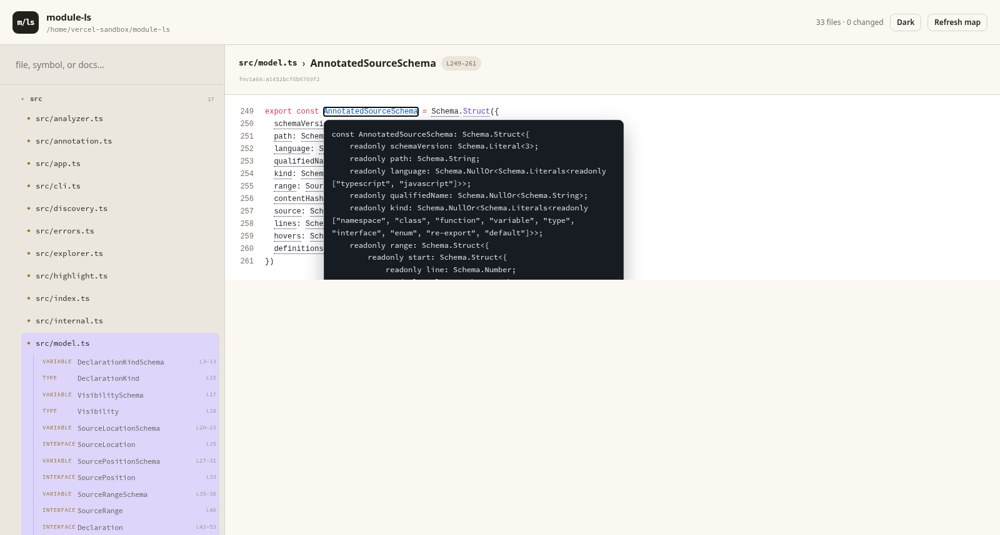

# module-ls

`module-ls` is `ls` for understanding JavaScript and TypeScript codebases.

It combines the filesystem, exported modules, opening documentation, exact
source ranges, and Git working-tree state into a compact CLI and a local code
explorer. It is designed as roaming documentation for humans and coding agents.



```text
$ mls src --peek --color never
src/
├── analyzer.ts
│   ├── │ TypeScript source analysis.
│   ├── extractLeadingDocumentation(source) [L53–64]
│   ├── contentFingerprint(source) [L104–111]
│   └── analyze(discovery, options) [L437–473]
├── model.ts
│   ├── DeclarationKindSchema [L3–13]
│   ├── SourceRangeSchema [L35–38]
│   └── … 38 more
└── index.ts
    └── 56 re-exports
```

The project is a functional prototype and is not published to npm.

## Try it

Node.js 24.13 or newer and pnpm are required.

```sh
pnpm install
pnpm check
pnpm dev src --peek
```

Build and link the two equivalent commands:

```sh
pnpm build
pnpm link --global
module-ls src
mls src
```

## CLI

Inspect one or more roots:

```sh
mls .
mls src --peek
mls src --symbols all
mls src --max-symbols 4
mls src --expand
mls src --format json
```

Tree output defaults to three directory levels and eight declarations per file,
and collapses files made entirely of re-exports. Cutoff directories contain an
explicit `…`. `--expand` disables all three reductions. JSON remains complete.
Every declaration includes a source line range.

| Option | Purpose | Default |
| --- | --- | --- |
| `--peek` | Show leading file documentation. | off |
| `--peek-lines <n>` | Limit documentation lines and imply `--peek`. | `3` |
| `--depth <n>` | Limit traversal below each root. | `3` for tree; unlimited for JSON |
| `--symbols <level>` | Show `modules`, `public`, or `all`. | `public` |
| `--max-symbols <n>` | Limit declarations shown per file. | `8` |
| `--expand` | Show all directories, declarations, and barrel exports. | off |
| `--format <format>` | Produce `tree` or `json`. | `tree` |
| `--hidden` | Include hidden entries. | off |
| `--no-ignore` | Disable `.gitignore` and built-in ignores. | off |
| `--ascii` | Use ASCII tree connectors. | off |
| `--color <when>` | Use `auto`, `always`, or `never`. | `auto` |

### Jump to source

`show` prints the exact syntax block with real source line numbers:

```sh
mls show src/analyzer.ts#analyze
mls show src/analyzer.ts --symbol analyze
```

```text
src/analyzer.ts:L437–473 · analyze · function · fnv1a64:…
437 │ export const analyze = (
438 │   discovery: DiscoveryResult,
    ⋮
```

`extract` emits the same selection as schema-versioned JSON, including its
0-based offsets and content fingerprint:

```sh
mls extract src/analyzer.ts#analyze
```

Targets accept `file.ts#Qualified.Symbol`, `file.ts:Qualified.Symbol`, or a
separate `--symbol`. Omitting the symbol selects the complete file.

### Open the explorer

```sh
pnpm build
mls serve .
# open http://127.0.0.1:4310
```

Use `--port <n>` to choose another loopback port. The explorer offers:

- a searchable directory tree with qualified-symbol children;
- file and declaration documentation;
- Shiki-highlighted, line-numbered source blocks;
- TypeScript quick info on hover and in-repository go-to-definition links;
- Git status badges and a changed-file count;
- typed, bidirectional file routes;
- refresh without restarting the service; and
- FoldKit DevTools during Vite development.

Use `--no-types` for syntax highlighting without starting a TypeScript language
service, or `--open` to launch the explorer in the default browser.

### Precompute an annotated snippet

`annotate` emits the same schema-v3 payload consumed by the web viewer. This is
useful for docs and other static sites: Shiki tokens and TypeScript information
are computed at build time, so TypeScript is not shipped to the browser.

```sh
mls annotate src/analyzer.ts#analyze --root . > analyze.json
mls annotate src/analyzer.ts --root . --no-types
```

### Author a guided walkthrough

Walkthroughs are ordered, nestable explanations with optional code targets.
Agents can author the schema-v1 wire format as JSON or YAML and render it as a
terminal tree, normalized JSON, or an interactive web page:

```sh
mls walkthrough examples/annotated-source.walkthrough.yaml
mls walkthrough examples/annotated-source.walkthrough.json --format json
# with `mls serve .` running:
# http://127.0.0.1:4310/walkthrough/examples/annotated-source.walkthrough.yaml
```

Library authors can build the same schema with an immutable, Effect-style DSL:

```ts
import { Walkthrough } from "module-ls"

export const tour = Walkthrough
  .make("request-path", {
    title: "Follow one request",
    summary: "Move from the HTTP edge to annotated source."
  })
  .add(Walkthrough.step("serve", {
    title: "Enter through the server",
    body: "The handler resolves and validates repository-relative paths.",
    target: Walkthrough.target("src/server.ts", { symbol: "serveExplorer" })
  }))
```

See the complete [YAML](examples/annotated-source.walkthrough.yaml),
[JSON](examples/annotated-source.walkthrough.json), and
[TypeScript DSL](examples/annotated-source.walkthrough.ts) examples.

For UI development, run the API and Vite separately:

```sh
pnpm dev serve .
pnpm dev:web
# open http://127.0.0.1:5173
```

## Agent output

`--format json` returns the complete recursive index as schema version 2.
Declarations contain three end-exclusive ranges:

- `range`: the declaration syntax block;
- `nameRange`: the identifier, when one exists; and
- `documentationRange`: the attached JSDoc block, when one exists.

Positions use 1-based lines and columns plus 0-based UTF-16 offsets. Files carry
an `fnv1a64:` content fingerprint so a consumer can reject stale offsets. The
fingerprint is an identity check, not a security hash.

The explorer also serves read-only JSON endpoints:

```text
GET /api/tree
GET /api/source?path=src/analyzer.ts
GET /api/source?path=src/analyzer.ts&symbol=analyze
GET /api/annotated?path=src/analyzer.ts&symbol=analyze
GET /api/search?q=analyze
GET /api/walkthrough?path=examples/annotated-source.walkthrough.yaml
```

`AnnotatedSourceSchema` contains offset-based highlighted tokens, quick-info
hovers, and definition targets. Its browser-safe contract is also exported from
`module-ls/viewer`. The inspection, selection, annotation, and search functions
are exported for programmatic use.

## What it understands

Supported extensions are `.ts`, `.tsx`, `.mts`, `.cts`, `.js`, `.jsx`, `.mjs`,
and `.cjs`. ts-morph recognizes exported functions, variables, classes,
interfaces, types, enums, namespaces, ambient modules, default exports,
re-exports, declaration files, and common CommonJS assignments.

The repository index remains intentionally shallow. The annotation path adds a
lazy, tsconfig-aware TypeScript language service for hover and definitions; it
does not evaluate project code, require a valid build, list class members, or
infer call graphs.

## Architecture

The entire project uses the same Effect 4 RC. The Node side uses Effect Schema,
the CLI in `effect/unstable/cli`, core filesystem/path/stdio/terminal services,
the process and HTTP modules, ts-morph, `NodeServices.layer`, and
`NodeRuntime.runMain`.

The web workspace is a native FoldKit application—not a React compatibility
layer. Its state is one Effect Schema `Model`; events are an
exhaustive Message union; network and navigation work are named Commands; the
view is FoldKit virtual DOM; routing uses FoldKit parsers; accessible controls
and theme tokens come from `@foldworks/ui`; Vite handles bundling and HMR; and StyleX compiles the
visual system to static CSS. The CLI and web workspace are pinned to the same
Effect release, while schema-validated HTTP JSON remains their runtime boundary.

See [SPEC.md](SPEC.md) for the exact contract and prototype boundaries.

## License

No license has been selected yet.
